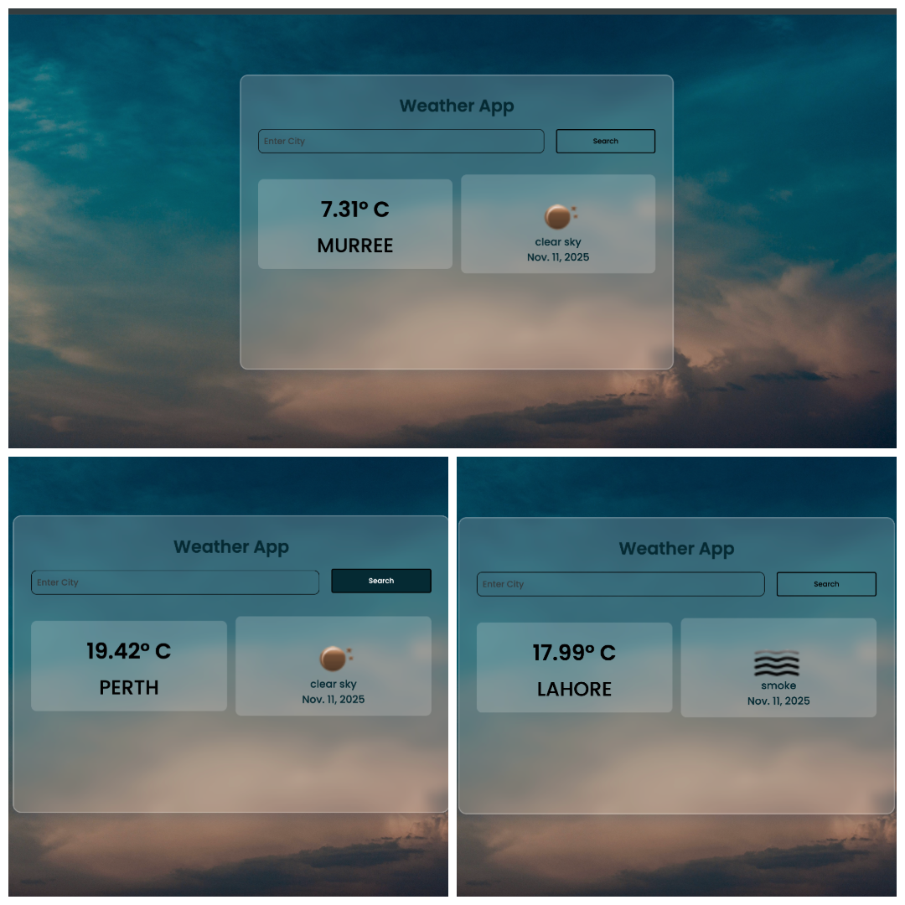

🌤 Weather App
A simple and responsive Django-based Weather Web Application that allows users to search for any city and get the current weather information along with a beautiful background image. 
The app is designed with a modern UI and glassmorphism effect for better user experience.
🚀 Features:
  *Search weather by city name.
  *Displays:
   .Temperature
   .Weather description (e.g., Clear, Rainy)
   .Weather icon
 *Beautiful responsive UI with glassmorphism container.
 *Static background image with overlay for better readability.
 *Responsive design for mobile and desktop screens.
 *Built with Django and uses OpenWeatherMap API for weather data.
 *Error handling for invalid city names.
🛠 Technologies Used
 *Backend: Python 3.13, Django 4.x
 *Frontend: HTML, CSS, JavaScript (optional for enhancements)
 *API: OpenWeatherMap API
 *Libraries: requests (Python HTTP library)
 *Others: Google Custom Search API (optional, for city images)

